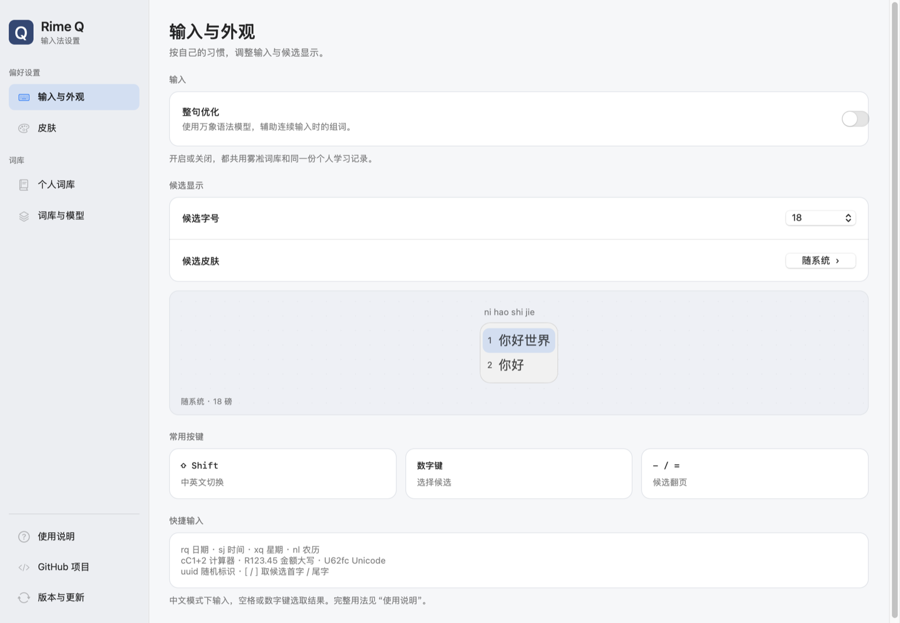
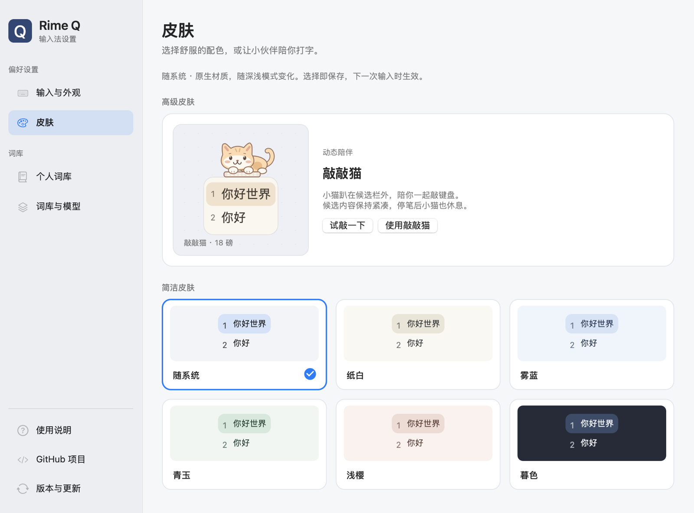
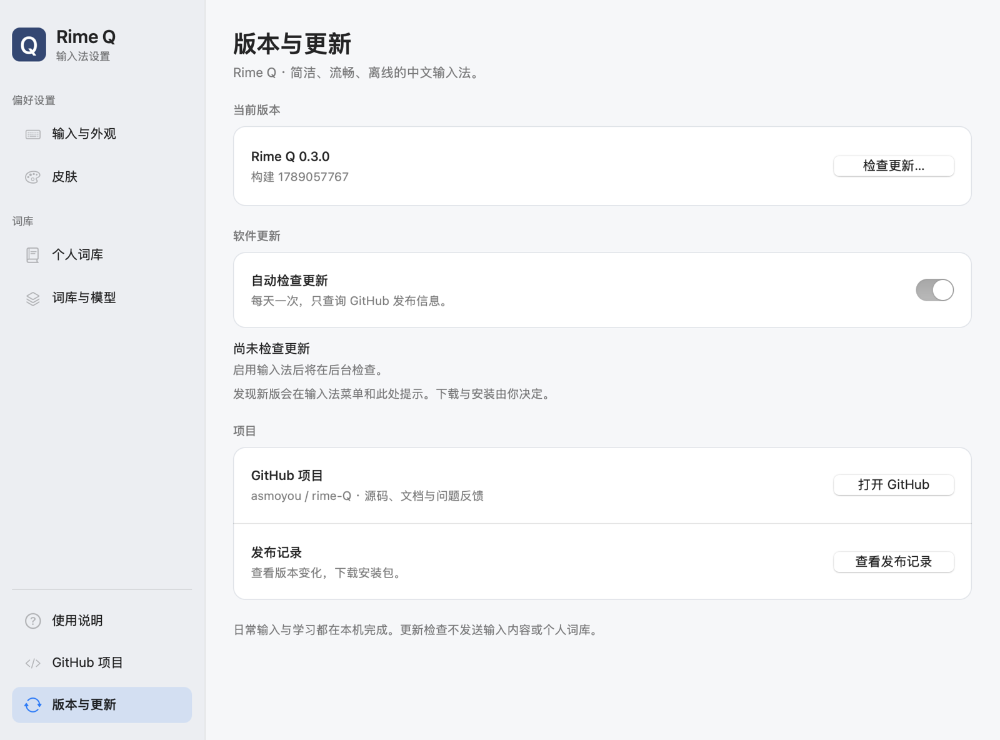

# Rime Q

**简洁、流畅、离线的中文输入法。**

基于 Rime 引擎，内置雾凇词库与可选的万象语法模型。熟悉的全拼输入，清晰的原生候选栏，再加上一只陪你敲键盘的小猫。

[下载 macOS 版](https://github.com/asmoyou/rime-Q/releases/latest) · [使用说明](docs/MACOS.md) · [版本记录](https://github.com/asmoyou/rime-Q/releases) · [反馈问题](https://github.com/asmoyou/rime-Q/issues)

[](https://github.com/asmoyou/rime-Q/releases/latest)
[](https://github.com/asmoyou/rime-Q/actions/workflows/ci.yml)
[](LICENSE)



## 为日常中文输入而做

- **装好就能输入。** 一个安装包包含引擎、词库和模型，无需另外安装鼠须管。支持简体全拼、空格与数字选词、鼠标选词、翻页和中英文切换。
- **输入留在本机。** 组词、候选和个人学习都在本地完成，断网也可以打字。更新检查只查询 GitHub 发布信息，不发送输入内容或个人词库。
- **按自己的习惯调整。** 原生候选栏按内容收紧宽度，支持四档字号、六款简洁配色与系统深浅外观；可选万象语法模型辅助整句组词。
- **让词库更贴合自己。** 搜索、编辑和导入导出个人学习记录；管理内置词表，导入带全拼编码的第三方词库，查看资源来源与许可。
- **常用工具，随手就有。** 在输入框里获取日期、时间、农历，计算表达式，转换金额大写，或输入 Unicode 字符。
- **升级时保留积累。** 安装器识别升级与同版修复，保留个人词库和设置，阻止旧包覆盖新版。默认每天检查一次更新，可随时关闭。

## 下载与安装

| 平台 | 当前支持情况 |
| --- | --- |
| macOS 13 及更新版本 | 已提供 PKG；同一安装包支持 Apple Silicon 与 Intel |
| Windows / Linux | 客户端规划中，尚无可安装版本 |

1. 前往 [最新版本](https://github.com/asmoyou/rime-Q/releases/latest)，下载 `RimeQ-0.3.0-macos-universal.pkg`。
2. 双击安装包，按 macOS 安装器的提示完成安装。应用会安装到系统输入法目录，并在后台完成启用。
3. 从菜单栏的输入法菜单选择 **Rime Q**，开始输入。

首次公开版本为 **0.3.0**。安装包已做本地 ad-hoc 签名，尚未完成 Apple Developer ID 签名与公证。若 macOS 阻止打开，请确认文件来自本项目，再按“系统设置 → 隐私与安全性”的提示处理（[Apple 说明](https://support.apple.com/zh-cn/102445)）。当前实际宿主测试主要在 Intel Mac 上完成，Apple Silicon 包已构建，更多设备与应用的兼容性仍在持续验证。

安装时，管理员认证用于写入系统输入法目录；安装器可能请求读取下载文件夹。升级较早版本时，也可能请求退出仍在运行的旧版 Rime Q。详见 [安装与授权说明](docs/PERMISSIONS.md)。

安装成功后通常可以直接切换使用。若未启用，应用会说明当前状态，并提供稍后处理、键盘设置和下次登录重试入口。排查步骤见 [Mac 使用说明](docs/MACOS.md)。

## 打字与快捷输入

| 按键 | 用途 |
| --- | --- |
| 空格 | 确认当前候选 |
| 数字键 / 鼠标 | 选择对应候选 |
| 单独按下并松开 Shift | 切换中英文 |
| `−` / `=` 或 Page Up / Page Down | 候选翻页 |
| Esc | 取消当前组合 |
| `[` / `]` | 取当前候选的首字 / 尾字 |

以下触发码在中文模式下使用，区分大小写；出现结果后，空格或数字键选取。

| 输入 | 结果 |
| --- | --- |
| `rq` / `sj` / `xq` | 当前日期 / 时间 / 星期 |
| `nl` | 今日农历 |
| `cC1+2*3` | 计算结果 `7` |
| `R123.45` | 数字与金额大写 |
| `U62fc` | Unicode 字符“拼” |
| `uuid` | 随机 UUID |

完整用法也可从输入法菜单的 **使用说明** 打开，无需联网。

## 选一款舒服的皮肤



“随系统”使用原生半透明材质，另有纸白、雾蓝、青玉、浅樱、暮色五款配色。选择即保存，下一次输入时生效；可在设置中预览 16、18、20、22 磅候选字号。

**敲敲猫** 趴在候选栏上边缘外侧，随按键交替敲击，停笔后安静休息。它不占候选内容空间，也不拦截选词。开启系统“减少动态效果”后保持静止；“随系统”配色同时遵循“减少透明度”。

## 词库与整句优化

**个人词库** 管理自己的学习记录，支持搜索、排序、新增、编辑、删除、撤销和 UTF-8 TSV 导入导出。删除个人记录后，内置词库中的同名词仍可能出现。

**词库与模型** 展示内置资源的来源、版本与许可，可以启停可选词表，导入独立的全拼 `.dict.yaml` 或 TSV/TXT 词表。编译在后台进行，成功后等当前输入结束再切换，失败时继续使用原词库。当前不支持直接导入 SCEL、双拼、形码或完整输入方案包。格式和限制见 [词库说明](docs/DICTIONARIES.md)。

**整句优化** 通过万象语法模型辅助连续输入中的同音字词选择。开启与关闭共用雾凇词库和个人学习记录；它是可选的组词辅助，效果取决于输入内容。

## 更新、备份与卸载



进入 **设置 → 版本与更新**，可查看当前版本、构建号和检查结果。自动检查默认开启，每 24 小时最多一次，重启应用也保留间隔；断网或请求失败会等待下一周期。发现新版时，输入法菜单和设置入口会显示提示，后台检查不会弹窗打断输入。

可以关闭自动检查，也可以随时使用 **检查更新…**。应用区分新版本、没有更新、尚无公开版本和请求失败。下载与安装由你决定，不会自动下载安装包。

个人数据保存在 `~/Library/Application Support/RimeQ`，其中 `rime` 是学习词库，`dictionaries` 保存第三方词库和管理配置。输入法菜单可以打开该文件夹；迁移个人词条时，建议从设置导出 TSV，在另一台机器导入。

从菜单选择 **卸载 Rime Q…** 可停用并移除应用，个人词库与学习记录默认保留。数据备份和手动卸载步骤见 [使用说明](docs/MACOS.md)。

## 从源码构建

需要 macOS 13+、Xcode 工具链和 Python 3.10+。首次构建会下载并核验固定版本依赖。

```sh
git clone https://github.com/asmoyou/rime-Q.git
cd rime-Q
python3 scripts/build_macos.py --universal --smoke
```

产物为 `dist/RimeQ-0.3.0-macos-universal.pkg`。已有资源缓存时可加 `--reuse-resources`；默认只保留 PKG，临时应用在打包后清理。

构建检查包括真实引擎与学习、快捷输入、词库管理、原生设置操作、候选皮肤、安装状态、更新版本比较和每日调度。CI 还会在独立运行环境安装实际 PKG，核验启用或明确的待启用处理，并验证卸载保留数据。

[验证记录](docs/VALIDATION.md) · [架构说明](docs/ARCHITECTURE.md) · [开发计划](docs/PLAN.md)

## 反馈与贡献

欢迎通过 [Issues](https://github.com/asmoyou/rime-Q/issues) 反馈问题或提出建议。报告输入或安装问题时，请附上 Rime Q 版本与构建号、macOS 版本、芯片类型、出现问题的应用和可复现步骤。示例输入与日志请先移除私人信息。

## 致谢与许可

感谢 [Rime](https://github.com/rime/librime)、[雾凇拼音](https://github.com/iDvel/rime-ice)、[万象](https://github.com/amzxyz/rime_wanxiang) 及相关资源作者。平台接入参考了 [RIMES](https://github.com/scholay/rimes) 的实现经验，Rime Q 使用独立的界面、标识与个人数据目录。

自有代码采用 [GPL-3.0-only](LICENSE)。第三方代码、词库和模型保留各自许可，来源、固定版本与校验信息见 [第三方声明](THIRD_PARTY_NOTICES.md) 和 [依赖锁定文件](dependencies.lock.json)。
