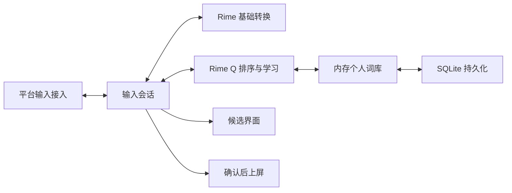

# 架构与算法约定

## 第一阶段

核心采用 C++17，先建立不依赖平台 UI 的算法和数据层。Mac 前端已通过 C API 桥接 librime 1.16.0，直接使用原生学习与候选语义。实验性个性化库尚未接入客户端，不宣称已改善实际候选准确率。RIMES 是平台接入、候选窗口与打包方式的参考，输入源安装器复用其经过验证的阶段执行与校验代码，保留 MIT 归属；其余客户端独立实现，内置资源直接从雾凇与万象的原始项目取得。

学习键由**编码命名空间 + 已解析编码**组成。命名空间由适配器标识方案及其编码版本；编码保留音节边界，`xi'an` 与 `xian` 不合并。大小写及空格/单引号分隔形式会规范化。不猜测无分隔全拼的音节，不把双拼、声调、辅助码或不同方案的用户库直接混用。

无个人偏好时保持引擎的候选顺序。有偏好时，完整匹配的置顶项优先，再根据选择次数与最近使用情况排序；未学习项保持相对顺序。只对当前精确编码召回个人词，避免把短码学习结果错误当成长串输入的完整候选。

候选保留引擎身份。完整匹配与前缀匹配的相同文本属于不同的提交动作，不能只按文本去重。个人词召回产生独立的完整文本提交动作；适配器必须清理整个组合态再提交，不能把此文本转成某个引擎候选序号。部分选词的完整组词学习由后续会话层在最终确认时处理。

排序只查内存，不访问数据库、不联网。词库加载和保存为显式 API；客户端必须在串行后台任务中保存，不能在逐键回调里执行 SQLite 事务。当前核心对象由调用方串行访问，不承诺线程安全。

实验性 SQLite 存储只包含用户明确确认的词条、规范化编码、选择次数、最近使用时间和置顶状态，不记录原始按键流、剪贴板或应用身份。保存一批增量使用事务；未知数据库版本或损坏内容返回错误，保留原文件。

算法的输入规模和个人词库容量有明确上限。达到容量时返回可处理的状态，不静默删除旧学习记录。算法参数和合成回归只是初始基线，尚未证明其优于 librime 的原生学习；接入后要比较原生学习、Q 学习以及组合策略，避免双重加权。

## 当前 Mac 接入

Swift + AppKit + InputMethodKit；候选窗口使用不抢焦点的原生面板，每个控制器有自己的 Rime 会话，窗口更新带所属控制器标识。后台只在启动时加载引擎；逐键路径没有联网、资源扫描或重新部署。

构建时预编译词库并将结果放入应用的 SharedSupport/build，用户目录仅保存个性化数据。基础模式与长句模式使用同一份 rime_q 用户词典；万象模型只在所选方案需要它时加载。模型在进程内部可能被缓存，关闭模式不承诺立即归还全部已映射资源。

原生 Rime 学习库位于 ~/Library/Application Support/RimeQ/rime，与鼠须管和 RIMES 数据隔离。退出时由 librime 完成正常保存；仍需覆盖异常退出与更新中断的验收。

## 资源与界面

前端掌握候选窗布局与皮肤。输入方案包不得直接覆盖用户的界面设置。

雾凇、万象作为可选方案包管理，专业词库作为经适配的叠加资源管理。安装多个完整方案不等于在一个会话里混跑多套规则；共享文件、Lua 名称、编码和模型依赖需要在资源管理阶段隔离、校验。

## 参考

- [Rime 输入方案与引擎组件](https://github.com/rime/home/wiki/RimeWithSchemata)
- [librime C API](https://github.com/rime/librime/blob/master/src/rime_api.h)
- [RIMES](https://github.com/scholay/rimes)，前期评估基线 `eba5185a3ed637b6df9ca9149fbfc49740bd58b2`
- [SQLite 事务](https://www.sqlite.org/lang_transaction.html)
