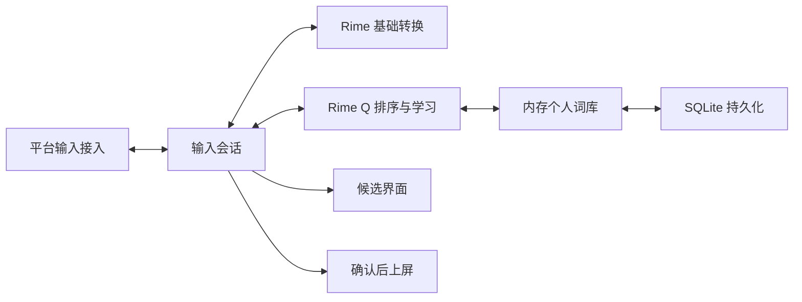

# 架构与算法约定

## 第一阶段

核心采用 C++17，先建立不依赖平台 UI 的算法和数据层。Mac 前端已通过 C API 桥接 librime 1.16.0，直接使用原生学习与候选语义。实验性个性化库尚未接入客户端，不宣称已改善实际候选准确率。RIMES 是平台接入、候选窗口与打包方式的参考，输入源安装器复用其经过验证的阶段执行与校验代码，保留 MIT 归属；其余客户端独立实现，内置资源直接从雾凇与万象的原始项目取得。

学习键由**编码命名空间 + 已解析编码**组成。命名空间由适配器标识方案及其编码版本；编码保留音节边界，`xi'an` 与 `xian` 不合并。大小写及空格/单引号分隔形式会规范化。不猜测无分隔全拼的音节，不把双拼、声调、辅助码或不同方案的用户库直接混用。

无个人偏好时保持引擎的候选顺序。有偏好时，完整匹配的置顶项优先，再根据选择次数与最近使用情况排序；未学习项保持相对顺序。只对当前精确编码召回个人词，避免把短码学习结果错误当成长串输入的完整候选。

候选保留引擎身份。完整匹配与前缀匹配的相同文本属于不同的提交动作，不能只按文本去重。个人词召回产生独立的完整文本提交动作；适配器必须清理整个组合态再提交，不能把此文本转成某个引擎候选序号。部分选词的完整组词学习由后续会话层在最终确认时处理。

排序只查内存，不访问数据库、不联网。词库加载和保存为显式 API；客户端必须在串行后台任务中保存，不能在逐键回调里执行 SQLite 事务。当前核心对象由调用方串行访问，不承诺线程安全。

实验性 SQLite 存储只包含用户明确确认的词条、规范化编码、选择次数、最近使用时间和置顶状态，不记录原始按键流、剪贴板或应用身份。保存一批增量使用事务；未知数据库版本或损坏内容返回错误，保留原文件。

算法的输入规模和个人词库容量有明确上限。达到容量时返回可处理的状态，不静默删除旧学习记录。算法参数和合成回归只是初始基线，尚未证明其优于 librime 的原生学习；接入后要比较原生学习、Q 学习以及组合策略，避免双重加权。

## 当前 Mac 接入

安装命令成功后转入同一进程的正常应用运行循环，创建引擎与 IMKServer，而非结束进程再依赖系统重新拉起。服务就绪后才写入包含运行进程号的成功状态。`--verify-runtime` 使用本机会话内的随机请求/应答，限定当前包的路径与构建号；只有引擎与 IMKServer 已初始化的进程响应。日常不运行轮询，安装检查与人工诊断时才发起短时探测。

Swift + AppKit + InputMethodKit；候选窗口使用不抢焦点的原生面板，每个控制器有自己的 Rime 会话，窗口更新带所属控制器标识。后台只在启动时加载引擎；逐键路径没有联网、资源扫描或重新部署。

构建时预编译词库并将结果放入应用的 SharedSupport/build。整句优化开关两种状态使用同一份 rime_q 用户词典；万象模型只在所选方案需要它时加载。模型在进程内部可能被缓存，关闭模式不承诺立即归还全部已映射资源。

设置中的个人词库通过 librime 官方 levers API 导出/导入实际学习记录。维护通知先结算各控制器的组合态并释放会话；随后在主线程串行维护用户库，下一次输入重新建会话。编辑只影响指定词条，操作前检查快照冲突并保存 TSV 备份。

第三方资源位于用户根目录的 dictionaries/imports；启用状态和当前资源代次保存在 configuration.json。每次资源修改在独立进程中根据内置规则、已选中文词表和规范化第三方词条编译新的 generations/UUID/build，辅助进程使用独立临时用户目录，不访问真实学习库。验证基础与整句优化方案后，等待各控制器当前组合输入结束，再由主线程重启引擎加载新资源，再原子写入配置；失败恢复原资源。只保留当前和前一代编译资源，学习数据不参与清理。

原生 Rime 学习库位于 ~/Library/Application Support/RimeQ/rime，与鼠须管和 RIMES 数据隔离。退出时由 librime 完成正常保存；仍需覆盖异常退出与更新中断的验收。

## 资源与界面

前端掌握候选窗布局与皮肤。输入方案包不得直接覆盖用户的界面设置。

各原生客户端共用产品层的页面、操作、状态机、数据格式和失败恢复规则；输入框架、系统菜单、安装权限与原生控件属于平台适配层。具体契约与例外见 [客户端功能一致性](CLIENT_PARITY.md)，架构取舍见 [跨平台客户端共用产品契约 ADR](plans/2026-09-12-cross-platform-client-parity-adr.md)。

雾凇、万象作为可选方案包管理，专业词库作为经适配的叠加资源管理。安装多个完整方案不等于在一个会话里混跑多套规则；共享文件、Lua 名称、编码和模型依赖需要在资源管理阶段隔离、校验。

## 参考

- [Rime 输入方案与引擎组件](https://github.com/rime/home/wiki/RimeWithSchemata)
- [librime C API](https://github.com/rime/librime/blob/master/src/rime_api.h)
- [RIMES](https://github.com/scholay/rimes)，前期评估基线 `eba5185a3ed637b6df9ca9149fbfc49740bd58b2`
- [SQLite 事务](https://www.sqlite.org/lang_transaction.html)

## Windows 原生客户端（0.4.0 开发版）

`windows/tsf` 是两个位数的原生 TSF DLL：管理按键、组合范围、显示属性、候选 UIElement 和语言栏菜单。写入前申请同步 TSF 写锁，测试按键回调不处理引擎事件；异步取消捕获原组合与原上下文，宿主修改文本时保留宿主内容。真实宿主验收独立于这些机制的隔离测试。

`windows/broker` 在一个用户进程里串行管理 librime，文件锁防止同一用户的数据库出现第二个写入者，命名管道按用户 SID 隔离并拒绝远程连接。x86/x64 共用有界、带版本的字节协议，客户端读写有总超时。启动预备一个可复用会话，避免每次连接重复加载词库。基础字典已在构建时部署。

`windows/settings` 使用 WPF 与 Windows 自带 .NET Framework，实现与 macOS 相同的个人学习库和词库资源管理。个人词库通过 Broker 调用 librime levers API，修改前比较快照并保存完整备份。第三方词库保留原文件和来源元数据，在 `dictionaries/generations/UUID` 中复制基础资源，通过独立临时用户目录调用随包 Broker 编译和真实候选验证；活动代次只由受限 UUID 指针选择。切换时正常停止并重新启动用户 Broker，失败恢复前一代或内置资源，真实 `rime_q.userdb` 不参与代次复制。模型校验在后台进行，切换等所有组合结束后完成；文件独立存储，通过硬链接供引擎读取。`windows/installer` 使用单个嵌入 ZIP 的 EXE，逐文件验证摘要，版本化安装目录避免覆盖正在使用的 DLL；系统注册与原始用户会话中的启用分开执行。

Windows 使用 librime 原生学习，未接入上述实验性核心。实现与验证范围见 [Windows 说明](WINDOWS.md) 和 [验证记录](VALIDATION.md)。

Windows 候选和设置预览共享 `windows/visuals/render.cpp`。TSF 静态链接绘制模块，WPF 通过 `RimeQ.Visuals.dll` 取得同源位图；完整猫咪坐标与姿态来自 `macos/Sources/TypingCat.swift`。皮肤选择沿用现有 Theme/Cat/FontSize 偏好，修改绘制不重置个人设置。
