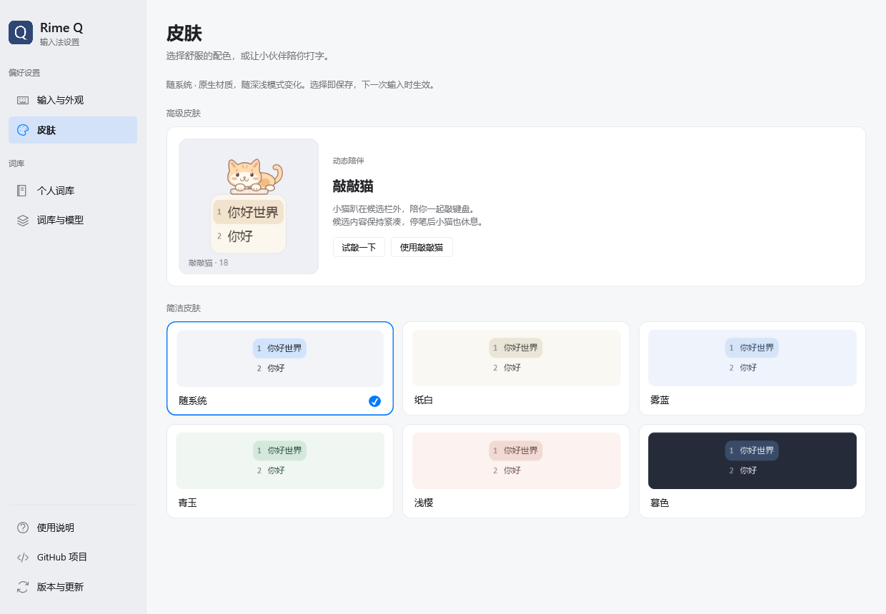

# Windows 客户端

Windows 客户端源码位于 `windows/`，使用原生 TSF 接入，独立进程运行 librime，设置使用 WPF。当前源码版本 **0.4.3**；安装包名为 `RimeQ-0.4.3-windows-x64.exe`，下载入口为 [GitHub Releases](https://github.com/asmoyou/rime-Q/releases)。系统级安装与外部宿主验收的实际状态见 [验证记录](VALIDATION.md)，不要将隔离测试等同于所有应用可用。

## 支持范围与功能

- 目标系统：Windows 10 22H2 / Windows 11 x64。包含 x64 和 x86 TSF DLL；Windows ARM64 原生宿主不在本包范围。
- 内置 librime 1.17.0、Lua、octagram、固定版本雾凇词库与 OpenCC 资源；预先编译词库，日常输入离线，无需安装其他输入法。
- 全拼预编辑、空格/数字/鼠标选词、翻页、取消、Shift 或 Ctrl+Space 中英文切换及焦点处理。TSF 发布标准键盘开关与转换模式；9131 起使用 `GUID_LBI_INPUTMODE` 及系统托盘能力注册可点击的“中/A”状态按钮，并接收远程控制常用的 Unicode packet 拼音按键；引擎未就绪、写锁被拒绝或连接失败时交回按键。
- 原生候选、六种配色、四档字号、栏外敲敲猫；按内容测量、屏幕边缘避让，中文保持微软雅黑 UI，并通过 DirectWrite 系统回退显示彩色 emoji；尊重 Windows 透明度、高对比度和动画设置。
- WPF 设置采用与 macOS 相同的五页结构、操作顺序和状态语义；独立皮肤页使用原版猫咪曲线，并与实际候选共用绘制模块。个人词库支持自动读取、搜索排序、增删改、修改前备份、撤销及 TSV 导入导出；词库资源支持清单、来源许可、第三方全拼词库导入编译、启停、预览、源文件导出、重新应用和恢复内置。
- 独立安装程序，读取实际已装版本/构建，拒绝降级，失败尝试回滚。程序按版本目录安装，避免覆盖宿主已加载的 DLL；卸载默认保留个人数据。

本轮后续对齐：附近设备同步在未启用时只显示入口，主动创建或查找才启动辅助程序；创建、加入和邀请分开引导，手动连接默认折叠，加入等待可取消，邀请显示倒计时和原设备确认。设备列表支持搜索和创建者选项菜单，恢复及退出放在“更多”。连接信息采用与 macOS 相同的三行格式；服务错误可重试，多局域网地址可选。Caps Lock 切换时先完成已有拼音组合，大小写交给 Windows，原中英文模式保持不变。相关功能在本机 0.4.2.9133/9134 开发包上隔离验证，0.4.3 发布状态以 Release 与验证记录为准；未测的跨设备场景见 VALIDATION.md。

设置界面跟随 Windows 默认**应用**模式，不跟随任务栏模式，也没有独立的应用内深浅开关。Windows 10 可在“设置 → 个性化 → 颜色 → 选择颜色：自定义 → 选择默认应用模式”切换；Windows 11 在“设置 → 个性化 → 颜色 → 选择模式”切换，选“自定义”时使用“选择默认应用模式”。已打开的设置和独立同步窗口会响应应用模式变化；系统高对比度优先。

9132 起，任务栏“中/A”使用透明背景、白色文字，并按字形实际笔画居中。Windows 输入服务 DLL 加载在各个应用进程中：升级时已经打开的应用可能继续使用旧版，需完整退出对应应用再打开。不同窗口的显示差异应先核对实际加载版本；不因此要求注销或重启电脑。

Windows 客户端使用 librime 原生排序与学习；根目录 C++ 实验核心及 `rimeq.exe demo` 仍为独立组件。当前未承诺 Windows Store/AppContainer、高权限应用、远程桌面和全部第三方编辑器兼容，这些场景必须分别验收。第三方词表支持独立全拼 `.dict.yaml`、TSV 和 TXT；不支持 SCEL、双拼、形码或完整输入方案包。跨平台产品契约见 [客户端功能一致性](CLIENT_PARITY.md)。



## 构建

需要 Windows x64、Python 3.11+、CMake 3.21+、Visual Studio 2022 Build Tools（C++ x64/x86、Windows SDK、MSBuild），以及 Windows 自带的 .NET Framework 4.8。无需额外安装 .NET Desktop Runtime 或 VC 运行库。构建工具和依赖的首次获取需要联网。

```powershell
python scripts/build_windows.py --smoke
```

资源已完整构建后可用：

```powershell
python scripts/build_windows.py --reuse-resources --smoke
```

开发构建可加 `--no-package`；用 `--build N` 指定递增的 Windows 文件构建号，范围 1–65535。默认构建号见脚本。产物为 `dist/RimeQ-0.4.3-windows-x64.exe` 和对应 SHA256SUMS；`build-windows/stage` 是打包目录，不应直接注册为系统安装。

构建使用固定摘要下载运行库和解包工具，只提取 Weasel 分发包里的 OpenCC 数据，不安装、执行或注册 Weasel 程序。依赖见 [dependencies.lock.json](../dependencies.lock.json)；完整雾凇源码归档、运行库版本记录及许可随包提供。安装包不包含 `.gram` 模型。

## 安装与个人数据

安装目录为 `%ProgramFiles%\RimeQ`，版本目录在其 `versions` 下。原生 TSF 标识固定为：

- CLSID：`{C13A9B62-413B-45B8-9EF1-884522319760}`
- 简体中文 Profile：`{984DA75B-478E-49B4-9CB6-945CA5E7AD41}`，LANGID `0x0804`

双击安装包，确认 Windows 管理员认证。认证用于写入本产品目录和注册两种位数的输入服务；取消时不完成操作。安装后的用户启用和后台启动由原始桌面用户进程执行，不在管理员账户下创建用户词库。安装只启用 Rime Q，不将其强制设为默认输入法。

个人目录为 `%APPDATA%\RimeQ`，学习库位于 `rime`，第三方词库与编译代次位于 `dictionaries`，可选模型位于 `models`。应用升级、修复和卸载均保留该目录。模型通过硬链接供输入引擎读取，不占两份空间，不依赖开发者模式。数据与小狼毫、RIMES、鼠须管及其他输入法隔离。

系统卸载入口、输入法菜单和通知区域菜单均提供卸载。只操作自己的标识与经路径检查的文件；宿主仍加载的旧 DLL 可能暂时保留。不能为测试卸载而删除用户现用输入法。

完整使用、备份、异常处理和手动卸载步骤见随包 [离线说明](../windows/resources/help/index.html)。

## 验证入口

`--smoke` 运行引擎/Lua/选词、跨进程个人词库学习、第三方词库真实编译与启停候选、设置与更新/下载策略、安装版本/路径检查及 WPF 渲染。另可运行：

```powershell
python scripts/test_windows_client.py
```

该测试用生产 DLL 连接真实 TSF 文本上下文、组合与写锁，驱动测试专用按键/焦点事件，并连接隔离的 x64 librime；覆盖 x64/x86 客户端。它不注册系统输入法，不更改默认输入法，不向用户窗口发送按键；发现已有 Rime Q 服务时拒绝占用同名管道。此测试不能替代记事本、浏览器和编辑器中的真实输入验收。

`windows/tests/candidate_tests.cpp` 检查候选测量、长注释、鼠标索引、装饰尺寸/透传/隐藏、边缘避让和 emoji 字体回退，并覆盖基础符号、补充平面、变体选择符、肤色、ZWJ、键帽、国旗及中英混排。四档字号、明暗皮肤和 200% 缩放会渲染为原生候选表面；x64 输出位于忽略目录 `artifacts/windows-ui`，x86 输出位于 `artifacts/windows-ui-x86`。设置测试使用隔离偏好目录，覆盖五页、深浅主题、三种尺寸、个人词库状态机、第三方词库真实编译与启停候选，以及皮肤/字号控件和动画停止；当前桌面会话若无法产生非透明 WPF 位图，会明确报告而不把空图计作目视通过。

已安装的构建 9132 在本机 x64/x86 RichEdit 宿主中均通过了六组物理按键测试，报告确认实际加载 9132；Profile/Broker 验证通过。9131 已完成个人词库回读、安装目录资源管理，以及已安装 x64/x86 TIP 的 Shift/Ctrl+Space、模式 compartment、系统任务栏按钮身份与 Unicode packet 回归。升级 9132 后曾发现 Explorer 仍加载 9131，刷新该进程后，ChatGPT、Explorer、设置、Sublime 与新记事本均加载 9132。用户已确认白色模式图标出现，刷新后的跨窗口图标稳定性与用户远程工具的真实输入仍待反馈。详见验证记录。

CI 的安装/修复/卸载步骤只在一次性运行机执行；个人数据保留与已装启用状态分别检查。本文不将尚未执行的 CI 或系统安装步骤列为通过。
