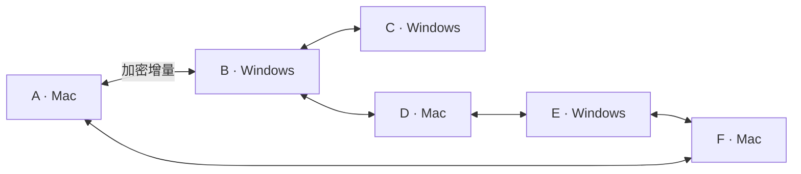

# 个人词库局域网同步方案草案

日期：2026-09-13。状态：最初产品提案，已进入开发。以下保留长期目标；本轮实际范围、技术决策和限制以 `docs/LAN_SYNC.md` 与 `docs/VALIDATION.md` 为准，不将本提案视为已实现清单。

## 产品决策

建议在“设置 → 个人词库”内增加“附近设备同步”：用户建立自己的同步组，每台新设备只需加入一次，此后组内在线且网络可互通的成员自动交换个人词条和学习权重。无需账号、服务器、共享文件夹或另外安装同步软件。

用户已明确自己有 6 台电脑，因此多设备同步组是首版基本需求。以至少 6 台真实设备作为基本验收场景，建议按 20 台日常使用规模设计，并用 50 个隔离节点做协议和故障压力测试。20 台和 50 节点是待验证的设计目标，不是已证明的容量或用户授权的硬上限；协议不硬编码 2–5 台，也不承诺无限扩展。

先交付 macOS ↔ Windows，并覆盖同平台组合。Linux 复用协议和核心，待客户端及系统适配实现后再承诺支持。多人共享公司词库属于另一种授权与数据模型，不混入个人学习库。

首版同步范围为当前 `rime_q` 个人词条、规范化全拼、学习权重，以及新增、修改、删除、恢复操作。这里的个人词条可能包含引擎学到的姓名、专有名词或短句，配对说明应明确是分享已有及后续个人学习记录。第三方词库包、模型、Lua、配置、皮肤和原始按键流不在此范围。

同步默认关闭，开启后只连接已获授权加入同一同步组的设备。同一 Wi-Fi 不代表允许分享，也不保证设备可互通：访客网络、客户端隔离、VLAN、防火墙均可能限制连接。

## 普通用户的操作

1. 在第一台电脑打开“个人词库 → 附近设备同步 → 创建同步组”，例如命名为“我的电脑”。首次说明同步范围、直连方式及授权用途。
2. 在任意已加入的设备点击“添加设备”，新电脑打开“加入同步组”。两端显示临时设备标识和系统类型，用户选择目标设备。
3. 原设备生成六位一次性配对码，新设备输入后通过绑定 TLS 通道的 SPAKE2 握手验证；原设备再确认加入，新设备获得可验证的组成员资格。配对码不是固定密码，不直接用作传输密钥。邀请只能用一次、有时限和尝试次数限制，正常后台运行不接受陌生设备弹窗配对。
4. 配对确认同时说明“本机已有及后续个人词库将与组内全部设备合并同步”。首次接收组数据的设备，以及首次接收新成员历史词库的现有设备，均在各自首次写入前保存恢复快照。邀请设备只持有部分组状态时，先合并已知数据，其他设备上线后再补齐。
5. 第三至第六台电脑重复“加入同步组”，每台只加入一次。其余成员验证签名成员记录后自动接受该设备，无须用户再逐对确认。六台电脑只需要五次新设备加入，不需要十五次两两配对。
6. 此后静默同步。页面按成员分别显示“已同步”“等待上线”“等待当前输入结束”或具体可处理的失败原因；支持搜索设备和筛选需要处理的状态。

发现设备失败时提供“使用连接地址”，由对端页面生成并显示局域网地址；仍须身份验证和双端配对。这只能解决发现失败，不能绕过网络隔离。二维码可作为辅助，桌面主流程不依赖摄像头。

界面示例：

```text
附近设备同步 · 我的电脑              已开启
6 台设备 · 当前在线 4 台（含本机）
当前在线设备已对齐；2 台离线设备待确认

这台 MacBook       本机 · 已应用当前已知变更
书房 Windows       已同步 · 刚刚
客厅电脑           已同步 · 刚刚
备用笔记本         已同步 · 刚刚
办公室 Windows     等待上线 · 上次同步昨天
旅行笔记本         等待上线 · 上次同步 3 天前

添加设备     立即同步     同步记录
```

设备详情提供重命名、暂停与移除。同步记录只显示时间、设备、数量和状态，默认不列出词条正文。恢复预览中仅按用户操作展示受影响词条。

“已同步”必须以该成员持久接收并完成引擎应用、回读确认的版本为依据。对端仅收到文件或仍在输入时不能显示为应用完成。设备级确认可由中间成员转发，但须保留来源并可验证，不能把中间成员的接收回执当成最终成员已经应用。

组摘要区分“当前可联系成员已对齐”和“尚有离线成员待确认”。在线成员对齐仅针对当前已知的版本，不能推断离线电脑没有尚未传出的新词；一个成员离线不会阻止其他成员同步，也不能让界面误报所有设备实时一致。上次确认的时间应始终可见。

## 多设备组与传播方式

同步组拥有随机且持久的组 ID，每台设备拥有独立身份和密钥；名称只用于显示。由当前有效成员在用户明确确认后签发加入授权，成员清单及变更带可验证的签名、来源和修订信息。数据只能在同组且当前本机认可的成员间交换，不因为名字相同或处于同一局域网而共享。

所有成员都可产生本机学习、接收和转发已认证的数据，不设置必须常开的主电脑，也不依赖最初创建组的设备继续在线。每台设备保留完整的已知合并词库和必要同步元数据。暂停同步仅停止本机传输，不清除成员资格；移除才改变组成员集合。

例如 A 的新词先传给 B，B 下次与 C、D 相遇时转交，D 再传给 E、F。记录保持原始来源，经过多少台设备都只计入一次。多条路径同时收到同一条记录也须去重。只要后续持续存在可用的接力路径，更新最终传播到全部有效成员；不要求六台同时开机，也不能承诺数据穿过长期互不接触的网络分区。

成员加入、移除及数据传播使用统一的组权限规则。本轮采用固定管理权限：只有创建者可以签发成员移除；创建者无需为日常同步保持在线。管理权限迁移不在本轮实现内。被移除设备先退出并取得新身份，再经邀请重新加入；不能复用旧成员记录。某成员在尚未收到撤销时仍可能与旧成员交流，这是局域网离线撤销的边界；收到撤销后拒绝旧成员身份及由其过期权限形成的无效加入授权，并收敛成员视图。并发加入、移除、重新加入及旧邀请重放属于协议安全审查和首版验收项。

## 系统结构



图示为六个对等成员间可能出现的连接，不是固定环形，也不要求所有连线同时存在。每个节点内部都包含“本机学习库 ↔ 引擎维护适配器 ↔ 共用合并核心与持久日志 ↔ 用户级同步服务”。

网络连接由独立、随包提供的用户级辅助进程负责；只在功能开启时运行，通过受本机用户身份约束的 IPC 请求引擎维护。不把 Windows Broker 的本地命名管道变为网络端口，也不让网络消息直接控制 IMK 或 TSF。用户关闭设置窗口后仍能同步，关闭功能后停止发现、监听与连接；普通输入不依赖同步服务存活。

实际采用共用 Rust 协议与合并核心，SQLite 保存操作日志、版本和恢复状态。它是新的同步存储，不将目前未接入客户端的实验性个性化数据库误当成现有学习源。Swift/AppKit 和 C#/WPF 实现相同产品状态及各自原生 UI。

设备发现采用 mDNS / DNS-SD：共用 mdns-sd 实现，原生客户端负责系统权限与操作入口。协议采用项目专用服务类型，例如拟议的 `_rimeq-sync._tcp`，正式发布前检查名称及互操作。日常广播只包含必要的协议版本与不含用户姓名的临时服务标识；可辨认的设备名称仅在用户打开邀请的五分钟内参与发现广播，其他时间通过认证后交换。

传输采用成熟 TLS 实现，优先统一 TLS 1.3、配对后的设备公钥固定和双向身份验证。具体 TLS 依赖需在最低支持系统上完成验证并记录版本、许可和安全更新责任；不能假定 Windows 10 的系统 TLS 与 Windows 11 能力相同。首次配对使用经过审查、绑定完整握手与设备密钥的核对流程，不自创加密算法。

设备私钥在 Windows 使用 DPAPI；2026-09-14 按用户确认，macOS 改为当前账户私有文件（目录 `0700`、文件 `0600`），接受同一账户下其他程序可能读取的边界。不兼容尚未发布的 Keychain 身份；旧同步状态归档后重新生成身份并配对，不访问钥匙串。传输加密不等于现有本机学习库已全盘加密，不扩大安全承诺。

同组发现后先交换各来源的版本摘要，只请求缺失增量；不把每次变更全量广播给所有设备。成员以自己的持久序号标识操作，接收方记录每个来源的连续接收水位及缺口，另行记录引擎应用水位；不能因先收到序号 100 就误以为 1–99 全部收到。每个成员的确认独立持久保存。

批量数据传输采用有界并发、去重、退避和公平调度，初始可按每设备同时 2–3 路批量传输做性能验证；这不是只能发现或联系 2–3 台设备。其他成员轮转检查摘要并最终获得传输机会。首次六台同时加入、网络恢复和组内广播突发时，避免同批数据反复绕行造成网络及磁盘风暴；不能仅优化吞吐而让某台设备长期追不上。

## 记录与合并规则

首版建议使用 Rime Q 自己的、带版本的记录协议，调用 librime 官方维护接口落地；不复制运行中的 `.userdb` / LevelDB，也不以整个输入目录作为同步对象。原生 Rime 同步 API 可作为比较方案研究，但当前客户端未接入，不能直接认定它已经满足产品的删除与恢复契约。

| 情况 | 建议规则 |
| --- | --- |
| 多台设备各有不同词条 | 合并保留 |
| 同词同编码 | 首版保留较高学习权重，不相加；权重不是实际输入次数 |
| 同词不同读音 | 分开保留，不能仅按汉字去重 |
| 同一数据重复或绕经第三台到达 | 按原始设备身份、代次和操作序号去重，不重复计入 |
| 删除与尚未见到删除的旧学习并发 | 删除优先，旧快照不能复活该记录 |
| 已看到删除后再次学习或明确重新添加 | 作为新代次处理；不把删除定义为永久禁词 |
| 多台设备同时修改同一手动词条 | 保留并发的可恢复版本，按词条集中提示检查，不按设备对弹出大量冲突窗口 |
| 设备时钟不一致 | 依赖持久序号和因果关系判断新旧，墙钟只用于界面显示 |
| 编码命名空间或协议不兼容 | 保留本地库并暂停相应同步，提示更新，不猜测转换 |

词条键包含编码命名空间、保留音节边界的规范化编码和文字。首版限已支持的全拼学习库，不任意混合声调、双拼原始按键或形码。

首版“较高权重”是与现有客户端兼容的保守产品取舍，可以同步积累的词条和较强学习偏好，但不能称为精确累计多台设备的输入次数，也不保证所有设备候选顺序完全相同。撤销降低权重、删除与恢复必须通过代次/操作语义处理，不能对所有情形一律取最大值。若将来引入按设备累计的学习计数，必须先能区分本机真实学习与远端导入，验证 librime 的实际学习语义，避免重复加权。

手动修改在本地成功且回读核实后形成操作；自动学习通过已有提交/变更信号仅设置脏标记，在空闲维护窗口导出规范化快照并比较差异。不新增逐次上屏全文历史。远端应用与基线更新要作为可恢复任务记录，避免远端词条再次被识别成本机新增。

删除标记须随状态传递并持久保存。只有所有有效成员确认相关删除和快照边界后，才能回收被这些确认覆盖的删除历史；不能简单按“过了 30 天”删除标记。保留删除屏障、来源水位和可恢复边界的情况下，可将详细旧日志压缩为检查点；长期离线成员回归时通过检查点加增量追赶，不要求每台设备永久保存无限的逐项历史。回归成员自身尚未上传的合法变更先保全，再按相同因果及删除规则合并，不被全量追赶覆盖。接收检查点不代表其他所有成员已应用。

长期不用的设备由用户明确移除，不能因为离线天数自动踢出；之后重新加入需重新授权并接受当前状态基线。恢复旧备份或克隆设备不能复用过期序号/设备身份来覆盖现状。全部设备丢失时，没有服务器的方案不能凭空恢复同步组和词库，须依靠用户持有的备份并创建新组。

## 与输入引擎的边界

现状是 macOS `Engine.maintain` 会发出维护通知，处理当前组合并释放会话；Windows Broker 会在仍有组合时拒绝个人词库维护。自动同步不能直接定时调用现有手动维护入口，否则可能打断输入。

新增统一的“仅在所有组合自然结束后申请维护”契约。接收、校验、合并和压缩在后台完成；实际引擎读写由现有唯一所有者串行执行，并在写入前再次核实状态与版本。持续输入时延后，不到超时时间就强行结算；设置页显示等待状态。

同步不得在逐键路径执行网络、全库扫描、磁盘事务或编译。维护与新首键的竞态必须专项验证；仅检查一次空闲并不能证明后续读写无延迟。若现有 levers 全库导出或应用达不到输入延迟要求，应先调整适配接口或维护方式，不能以强制上屏、吞键或输出裸拼音来隐藏阻塞。

SQLite 事务和 librime 数据库不是同一事务系统。采用持久的“待应用 → 应用中 → 回读确认”日志和幂等恢复：接收批次完整校验后才能入队；写入前保存快照；回读核对后才推进应用水位。部分失败保留日志与备份，下一次运行先恢复，不把“有 SQLite”描述为自动实现跨库原子性。

## 权限、安全和离线行为

| 申请方与用途 | 触发时机 | 拒绝后的行为 |
| --- | --- | --- |
| Rime Q 访问本地网络，用于发现和连接已授权的同组设备 | 主动开启/添加设备时触发系统授权 | 同步暂停，输入、个人学习和本地导入导出继续使用 |
| Rime Q 同步组件的 Windows 入站通信 | 用户启用同步且系统要求放行时；规则限定自己的程序、所需端口、专用网络及本地子网 | 明确显示连接受限，提供系统设置指引，不反复索取权限 |

macOS 15 起存在本地网络隐私控制。需在真实签名应用及辅助进程启动链中验证权限归属，提供相应本地化用途说明和 Bonjour 声明。不能以终端中测试成功代替安装应用的授权验收。

仅监听允许的局域网接口；公共网络及 VPN 默认不启用发现和监听，平台无法可靠识别时需清楚展示网络范围并由用户开启。网络类型只是减少暴露面的措施，任何网络都必须验证配对身份。不开启 UPnP、不做端口映射、不使用公网发现或中继。

移除设备后本机立即拒绝该设备的新连接，并向其他成员传播撤销。其他离线设备在收到撤销前无法保证已经更新信任；纯局域网系统不能承诺即时全局撤销。已经复制到对方设备的词条无法远程收回。丢失设备场景要在设备管理帮助中说明这一边界。

数据协议只接收有界的词条及操作字段；验证 UTF-8、编码命名空间、数量、长度、解压后大小及版本。网络端不能提交路径、脚本、配置或任意文件。日志默认不记录词条正文、原始输入、密钥或完整协议包。

断网、休眠、切换网络后保留本地待同步队列，重连交换缺失版本并采用退避重试。没有共同在线或接力路径时，只能等待下次局域网相遇；完全无服务器模式无法实现跨城市即时送达。

## 备份与恢复

同步会传播操作，因此必须单独提供恢复能力。首次合并、批量删除和重要导入前保存版本快照；日常同步快照按容量和版本保留策略压缩，不能把每一批同步都覆盖到现有 `before-last-change.tsv` 并破坏手动撤销。

“恢复到此前状态”先比较受影响记录，再生成新的补偿操作；不能简单回滚同步数据库，否则旧删除和旧设备水位会重新流入网络。若备份之后已有本地新学习或远端修改，只恢复未冲突部分，并让用户检查冲突。恢复过程也须可中断重试。

关闭同步或卸载默认保留个人学习库；同步配对、密钥及日志的清理提供明确的独立操作。同步服务应遵循现有安装与升级流程，普通后台同步不需管理员权限。

## 方案比较与拟议 ADR

以下决策均为 Proposed，未视为用户已确认。

| 决策 | 推荐 | 备选与取舍 |
| --- | --- | --- |
| 使用入口 | 创建个人同步组，新设备加入一次，其余组员自动识别 | 两两配对需要随设备数量增加维护大量关系，不适合六台及更多电脑；Syncthing/共享文件夹也需要额外配置并解决记录合并 |
| 连接拓扑 | 无固定主机的局域网多成员直连、接力及有界传输 | 固定主电脑关机会阻断其他设备；WebDAV/NAS 可后续作为可选密文通道，账号云同步新增身份、服务器、恢复与运营成本 |
| 数据边界 | 专用记录协议 + 官方引擎维护接口 | 整目录同步耦合运行库、路径及脚本，无法满足最小权限与兼容性；原生 Rime 同步需先验证契约 |
| 权重合并 | 第一版同键同代次取较高值 | 简单相加会在往返同步中虚增；每设备计数更复杂且现有 TSV 无法证明学习来源 |
| 删除与版本 | 持久删除标记、设备序号、因果关系 | 文件时间或“最后上传覆盖”会受时钟、离线及重复传输影响 |
| 进程 | 用户级网络辅助进程 + 引擎唯一写入者 | 直接把监听服务放进输入回调所在进程会扩大网络故障和解析故障对输入的影响 |
| 首版范围 | 同一人的 Mac/Windows 个人词库 | 账号、团队公共词库、手机与模型分发单独规划，避免混淆授权和数据语义 |

内置方案无需词库服务器和存储流量费用，但需要承担跨平台网络适配、依赖安全更新、签名、真实设备测试和支持成本。它采用成熟网络与存储技术，新增的 Rime Q 同步实现仍需生产验证，不能称为已有开箱即用的商业同步模块。

## 交付门槛与预算参考

先做兼容性及多成员协议验证，再实现完整体验，最后执行故障与真实输入验收。此前 6–10 周仅为粗估；明确六台真实设备、成员授权传播、并发撤销与多跳恢复后，不能直接沿用该数字作为交付承诺。应在完成多节点原型及安全审查后，按开发、测试人力和真实设备条件重新估算。学习差异捕获、维护延迟、跨库恢复、成员收敛和设备撤销是主要不确定项。

必须通过的测试：

- Mac ↔ Windows、Mac ↔ Mac、Windows ↔ Windows 真实引擎新增、学习、召回、删除与恢复；不同内置 librime 版本的兼容性。
- 至少六台真实设备进同一组，每台只加入一次；原创建电脑关机或被移除后，其余成员仍可同步及邀请新设备。
- 六台并发增删改、权重降低与撤销、重复/乱序/缺序传输、A→B→C→D→E→F 多跳接力、环路去重、离线删除后重连及设备时钟偏差。
- 六台分成 3+3、2+2+2 网络分区，各自学习及修改后重新相遇；验证全部有效成员最终收敛，冲突版本和本地尚未上传的新学习均不丢失。
- 单台离线 30/90 天后的检查点追赶，保留删除屏障；暂停和恢复、成员并发加入与移除、旧邀请和旧身份重放、重新加入与签名回执转发。
- 20 节点功能与容量验证、50 节点协议压力测试，覆盖公平调度、带宽、连接数、日志增长和网络恢复突发；模拟结果不能替代六台真机的输入及权限验收。
- 首次合并、断网、休眠、IP 变化、多网卡、防火墙阻止、访客网络隔离，以及授权拒绝后恢复。
- 应用日志各阶段崩溃、导入部分成功、磁盘满、损坏数据、旧版本客户端、新设备及旧备份重新加入；验证不会丢库、误报完成或使词频虚增。
- 配对伪装、验证码不一致、未授权设备、移除后连接、重放、输入限额与超大数据。错误不输出词库正文。
- 在独立空白文档中测试持续输入、同步期间首键、组合、空格/数字选词、取消、中英文切换及焦点变化，确保不强制结算、不吞键。
- 同步关闭、无变更、等待设备、持续学习四种状态下的 CPU、内存、唤醒、流量及输入延迟。报告机器、样本、词条规模和冷热缓存条件。

建议以直接相连的在线成员引擎空闲时，普通小批增量在 5 秒内完成作为单跳初始体验目标；六台全部在线且网络可互通、引擎空闲时，普通小批变更传播到全部成员可先按 15 秒目标评估。20 万条上限用于词库容量验收。以上均为待测目标，需注明网络拓扑、词条规模和负载；不能把单跳耗时当成全组耗时。持续输入、对端休眠、网络分区或仅有间歇接力路径时不承诺固定完成时间。

后续实施需要同步更新两端设置契约、权限说明、安装/离线帮助及隐私文案。更新检查仍不发送个人词库；开启局域网同步后的学习数据分享必须在文案中单独说明。实际测试完成后再向 `docs/VALIDATION.md` 写入证据，本次文档不新增通过结论。

## 已核实的基础与参考

- 当前 [Mac 个人词库](../../macos/Sources/PersonalDictionary.swift) 和 [Windows 个人词库实现](../../windows/settings/Infrastructure.cs) 通过官方 levers 导入导出，已有较高权重合并、删除标记、备份及回读，但没有此处提出的设备和同步协议。
- [当前架构](../ARCHITECTURE.md)、[两端产品契约](../CLIENT_PARITY.md)、[依赖锁](../../dependencies.lock.json)。锁中 Mac librime 为 1.16.0、Windows 为 1.17.0，因此不能省略互操作验证。
- [librime 固定版本的 UserDictManager](https://github.com/rime/librime/blob/a251145d3aafa33871824a40bbec04c966bd8b56/src/rime/lever/user_dict_manager.cc)。接口存在不代表应用已接入自动同步。
- [Microsoft DnsServiceBrowse](https://learn.microsoft.com/en-us/windows/win32/api/windns/nf-windns-dnsservicebrowse)：系统提供局域网 DNS-SD 发现，最低客户端为 Windows 10。
- [Apple TN3179：Understanding local network privacy](https://developer.apple.com/documentation/technotes/tn3179-understanding-local-network-privacy)：说明 macOS 15 起的本地网络隐私、Bonjour 声明与辅助进程的权限归属。
